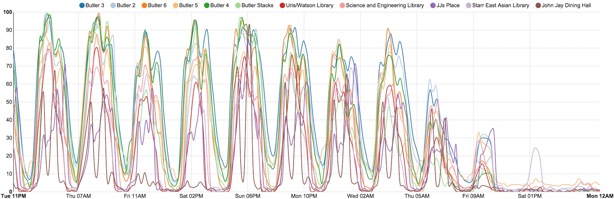

## ρ(t)

Shows the history of fullness for different places on campus using the estimates provided by [density.adicu.com](http://density.adicu.com/) every 15 minutes. Find trends! Confirm your intuitions! Deviously snatch up study space!

For smoother curves, try changing `percentages` and `times` to `percentages[0::N]` and `times[0::N]` in `plot.py`'s `chart.add_serie()`. This will plot every Nth data point. Interpolation settings can also be changed in `plot.py`.

Because this pesky script wants to get data constantly, it can send you an email when it exits unexpectedly or when it's unable to get data, so that you can grunt in the morning and roll over to fix it. It also saves all the data it collects to a history file that you can explore at your leisure.

### Dependencies

Python:

- urllib3
- parse
- pickle
- nvd3

Other: 

- npm
- bower

### Running

    bower install nvd3#1.1.12-beta
    ./rho_t.py

This produces an `index.html` file containing the chart and a `history.p` file that gets updated every time new data comes in.

